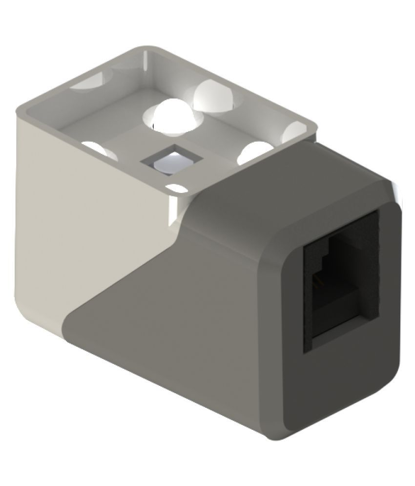
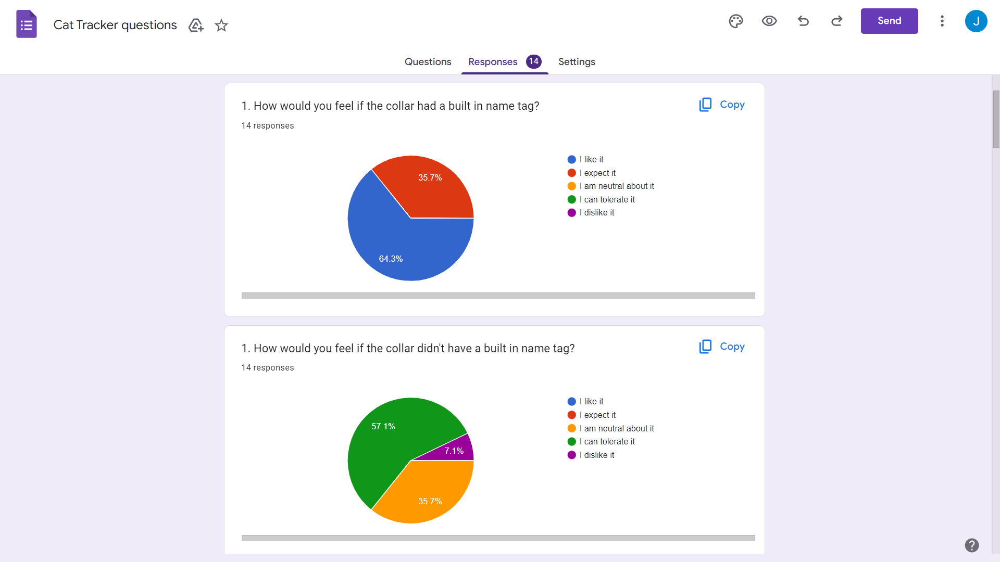
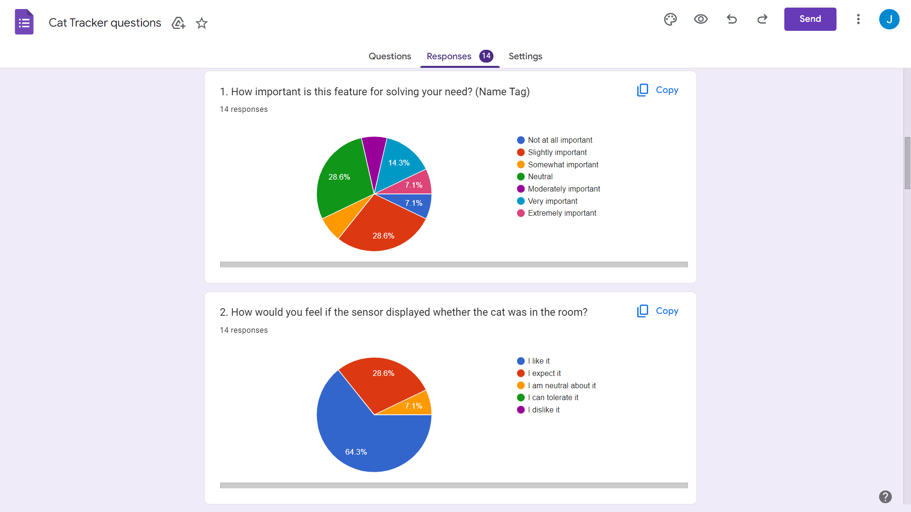
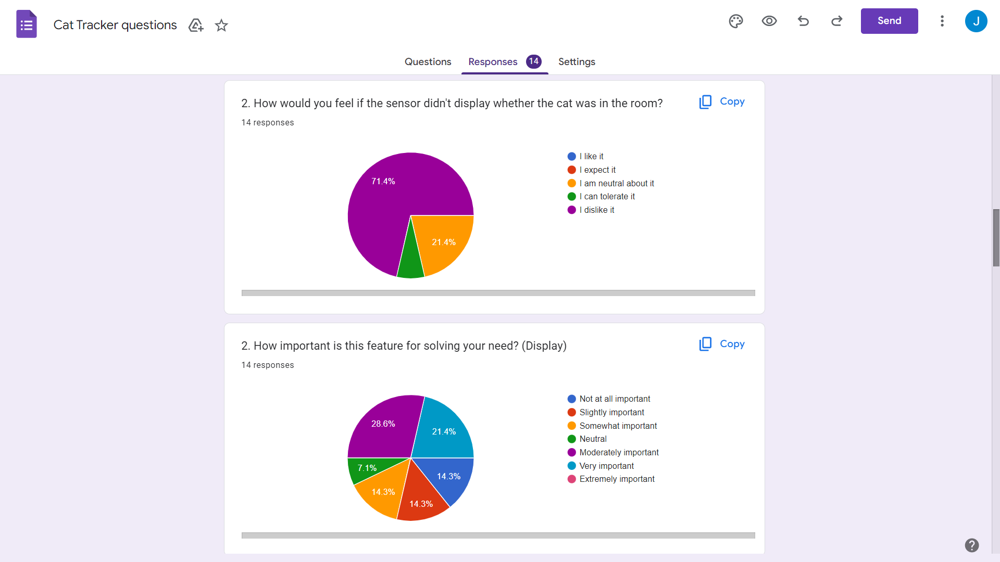
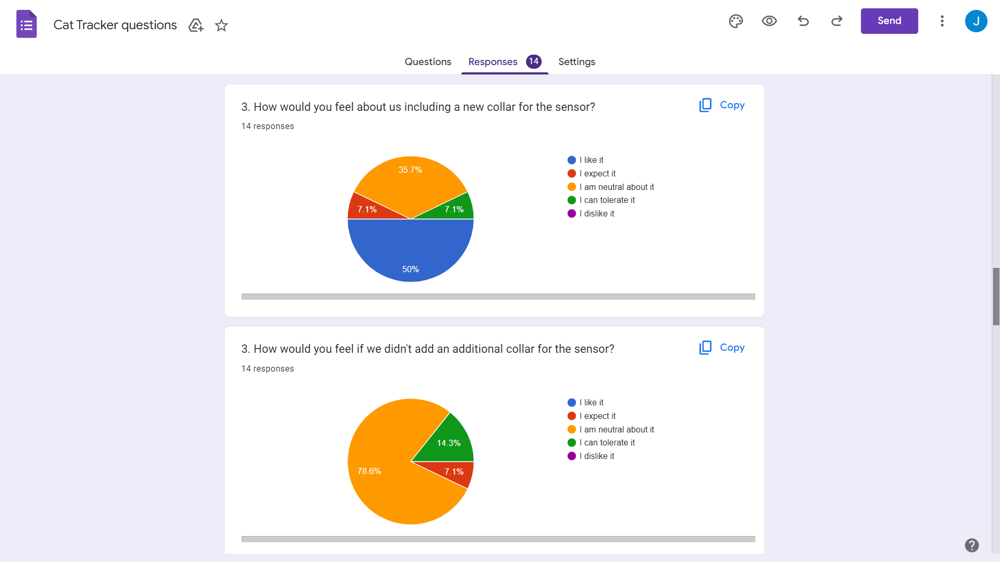
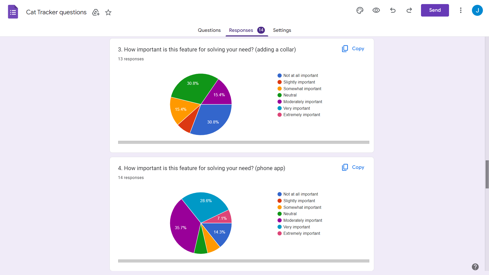
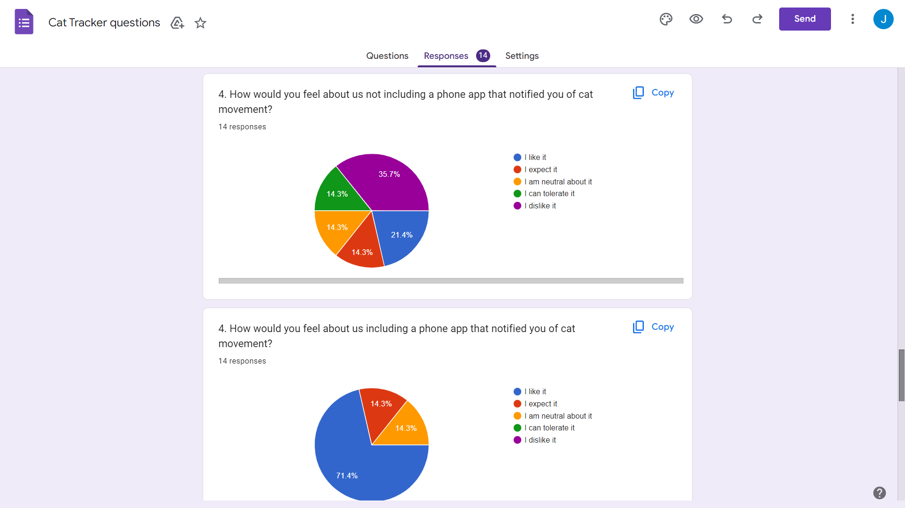
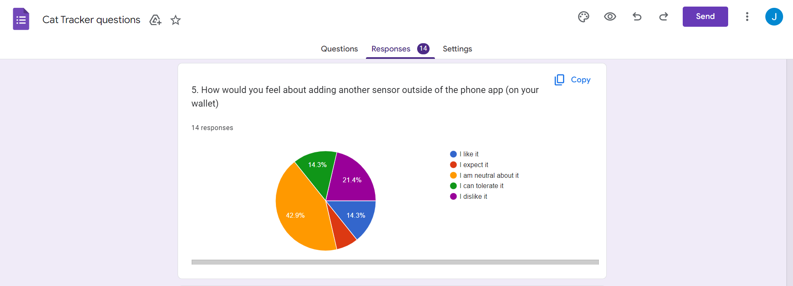
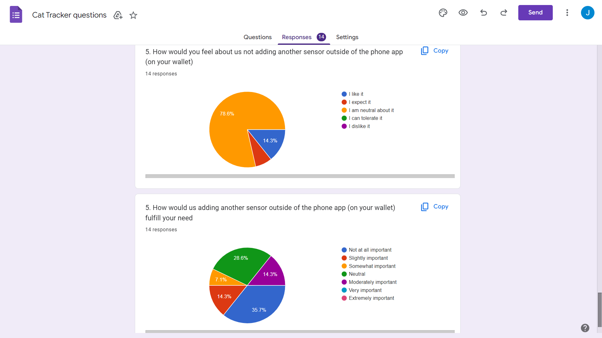

# HW5 Report

**Aleksandar Jeremic, Jason Jiang, Andy Zhang**

**5/6/23**

## Challenge 1: Customer Pitch

(Individual Work, submitted separately on Canvas)

## Challenge 2: Customer Questions

1. Q: What kind of cat is it, and whose cat is it? A: The typical house cat, and the cat is my roommate's.
2. Q: How many cats are in question? A: 1 cat.
3. Q: What are the dimensions and floors of the house? A: 1-story apartment.
4. Q: What basic functions must the device do? A: Know when the cat enters the room.
5. Q: What is the scope of the sensor? A: Detect when the cat is entering or leaving the room.
6. Q: Are there any environmental restrictions for the room in question? A: There is a wall next to the door, no major obstacles in the room.
7. Q: Does the cat mind accesssories? A: The cat wears a collar, which could be used to attach a sensor to.
8. Q: What should the sensor output? A: Should not output any noise, maybe a notification to your phone or a visual indicator, like a light.
9. Q: Should the device be battery powered, or via an electrical socket. A: A replacable battery is preferred.
10. Q: What size preferences do you have for the sensor? A: Roughly the size of the adapter found on the charger for a laptop.
11. Q: Is there a TV in the room? A: No there is not.

Here is a concept design of our main sensor:

With the information collected from the questions, this set us up for our research on some background information. We discovered the following:

An IR (infrared) receiver works by encoding incoming IR signals (digitizing the signal) and amplifying them, this information is then trasmitted using wires into whatever your circuit is made to do. The IR remote will send an encoded (binary) message in the 38kHz range (IR range) this signal will be transmitted into the air. IR signals from a weak remote will only be detectable from a couple of feet away from the sensor, which makes its nice for detecting the cat moving near the sensor without messing with any other appliances.
Our code for the detection of distance is fairly simple, We only need to run a code that detects the intensity from the sensor which we will have emitting a set IR key. From this point we can determine which of the 2 sensors the cat is closest to which we can use to determine whether the cat is in the room.

## Challenge 3: Surveying Potential Customers

We designed our survey around the following 5 features:
1. Should sensor include a name tag?
2. Should the sensor display whether the cat is in the room or not?
3. Should the sensor come attached with a collar?
4. Should there be a phone app to receive notifications from the tracker?
5. Should we include additional displays for the sensor to output to? For example, an extra display attatched to your wallet.

Via google forms, we created our survey and followed the guideline, where for each feature, we asked the 3 relevant questions, totaling to 15 questions for responders to fill out. We had 14 responses. All respondees are college students attending UCSD, so the results of the survey should not be generalized to the whole population of cat owners. Below are all the results of our survey:

Some common trends include people believing the display show whether the cat was in the room highly necessary and enjoying the idea of a collar and a name tag being included on the display. Survey results also show that including an additional sensor on such as your wallet was not very popular. The inclusion of a phone app seemed to be somewhat split on opinion.

In conclusion, it seems our main customer and the respondees share the need of having the display show whether the cat is in the room or not while disagreeing on the idea of additional displays. As for the phone app, our main customer sees it as quite helpful while the respondees have a more mixed opinion, believing it to be a delight. The other 2 features mentioned are likely all seen as bonus features that would be nice if they were included. Here are our mappings based on the Kano Method:
1. **Name tag -> Attractive**
2. **Display cat in room -> One-Dimensional**
3. **Collar -> Attractive**
4. **Phone App -> One-Dimensional**
5. **Extra Displays -> Reverse**

Displaying whether or not the cat is present and creating a phone app to receive notifications from the sensor will be our priority. We will likely also follow through on displaying the name tag and have the sensor be attached to a collar, since we believe this can simplify our work.